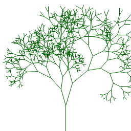

# Stumpy Utils

A collection of drawing functions for `stumpy_core`, `stumpy_png`, ...

## Usage

### Install the `stumpy_utils` shard

1. `shards init`
2. Add the dependency to the `shard.yml` file
 ``` yaml
 ...
 dependencies:
   stumpy_utils:
     github: stumpycr/stumpy_utils
 ...
 ```
3. `shards install`

You also need to install and require (at least) one of the image extensions
(
[stumpy_png](https://github.com/stumpycr/stumpy_png),
[stumpy_gif](https://github.com/stumpycr/stumpy_gif)
)
or
[stumpy_core](https://github.com/stumpycr/stumpy_core).

## Canvas

### `Canvas.line(x0, y0, x1, y1, color = RGBA::BLACK)`

Use the Bresenham algorithm to draw a line from (x0, y0) to (x1, y1).

#### Example

``` crystal
require "stumpy_png"
require "stumpy_utils"
include StumpyPNG

record Branch, x0 : Int32, y0 : Int32, dir : Int32, length : Float64 do
  RADIANTS = Math::PI / 180.0
  FACTOR = (0.6..1.0)
  ANGLE = (30..90)

  def x1; x0 + (Math.sin(dir * RADIANTS) * length).to_i; end
  def y1; y0 + (Math.cos(dir * RADIANTS) * length).to_i; end

  def split
    angle = rand(ANGLE) / 2
    [Branch.new(x1, y1, dir + angle, length * rand(FACTOR)),
     Branch.new(x1, y1, dir - angle, length * rand(FACTOR))]
  end
end

branches = [Branch.new(128, 256, 180, 50.0)]
canvas = Canvas.new(256, 256, RGBA::WHITE)

10.times do |i|
  branches = branches.flat_map do |b|
    canvas.line(b.x0, b.y0, b.x1, b.y1, RGBA::DARKGREEN)
    b.split
  end
end

StumpyPNG.write(canvas, "tree.png")
```


